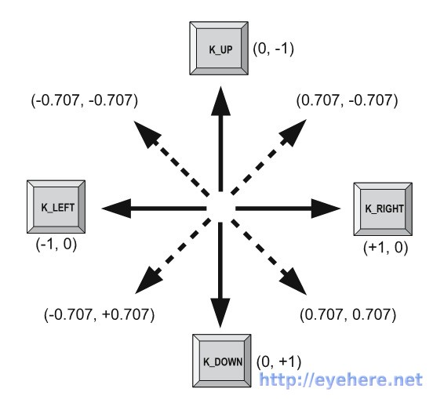

some note
=========

#### 方法

``` python
# 显示标题
pygame.display.set_caption(str())
```

#### 键盘模块

- key.get_focused   返回当前的pygame窗口是否激活, 返回bool
- key.get_pressed   获得所有按下的键值
- key.get_mods      按下的组合键(Alt, Ctrl, Shift)
- key.set_mods      模拟组合键(`KMOD_ALT`, `KMOD_CTRL`, `KMOD_SHIFT`)
- key.set_repeat    无参数时不产生重复按键事件, 二参数(delay, interval)设定 延迟delay毫秒产生第一个KEYDOWN, 后每隔interval毫秒产生一个KEYDOWN事件
- key.name          接受键值返回键名

#### 使用键盘控制方向

> 引用[目光博客](http://eyehere.net/2011/python-pygame-novice-professional-10/)


